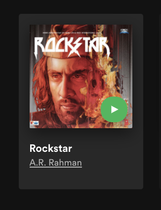
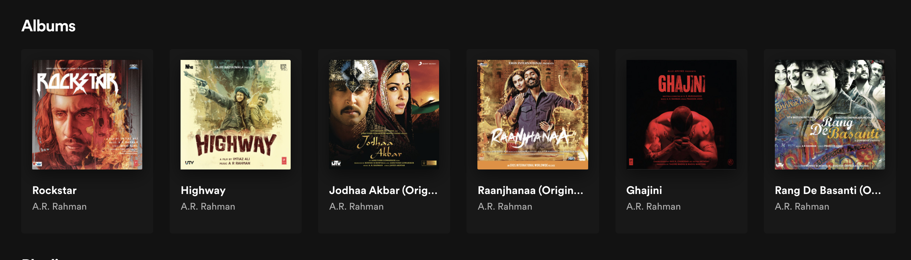

# Day 6

## Spotify: List of Albums

1. Create a component called `Album` which contains your favourite musician name, your favourite album by them and the album cover as shown in this picture and render it in the `App` component  

2. Now store artist, album and album cover in the `App` state and pass them as props and display them in the `Album` Component
3. Add a property called `albums` in the state of `App` component and set it's value to be an array of objects where each object represents one album which has properties like `id`, `artist`, `album_title`, `album_cover`, `songs` etc
4. Create a component called `Albums` which will display multiple `Album` components. Insert an `Albums` component into the render output of `App` and pass the albums array from state of `App` to `Albums` component as props.
5. Inside `Albums` component map over the album props and for each album in the array create a new `Album` component to be displayed inside `Albums`. Be sure to pass the id of each album as a key to each `Album` component. For each album object, pass it as props to the `Album` component.  

   